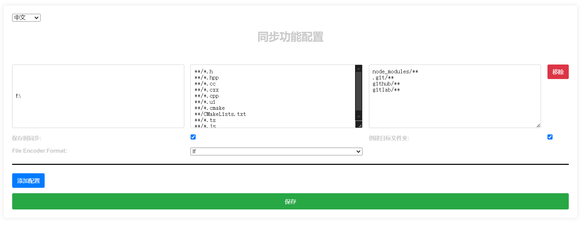

# Sync on Save

This extension synchronizes files automatically when you save them.

## Features

- Automatically sync files on save.
- Configurable patterns for file matching.

## Installation

1. Install the extension from the VS Code Marketplace.
2. Open `syncOnSave.initConfigSyncFile` command to create sync.json config file.
3. Edit your owner sync configures in sync.json file.

## Usage

Edit your owner sync configures in sync.json file.

## Configuration



Add the following to your sync.json:

```json
{
  "targetFolders": [
    {
      "path": ".",
      "include": ["**/*.ts", "**/*.js"],
      "exclude": ["node_modules/**"]
    }
  ],
  "syncOnSave": true,
  "createTargetFolder": true
}