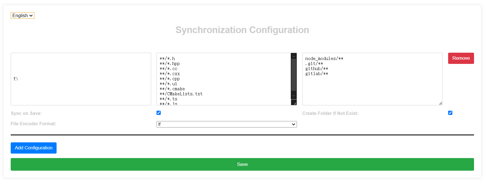

# Sync on Save

The syncOnSave extension supports backing up files to other folders upon saving. It also supports backing up to multiple target folders. File formats can be specified using regular expressions, and it includes filtering options to exclude unwanted file formats. When synchronizing files, you can choose whether to convert them to lf or crlf format.

## Features

- Automatically backs up files to multiple target folders upon saving.
- Supports backup configurations for multiple paths.
- File formats can be specified using regular expressions.
- Supports format filtering and regular expressions.
- Supports modification of file encoding line format during synchronization.

## Installation

1. Install syncOnSave directly from the Visual Studio Code extension gallery.
2. Search for syncOnSave in the VS Code Marketplace and install it.

## Usage

1. Select the syncOnSave.initConfigSyncFile command to open the configuration page and simultaneously initialize the creation of the sync.json file.
2. Configure synchronization rules via the web-based UI.
3. If you are familiar with syncOnSave, you can directly edit the sync.json file manually.

## Configuration



Open the syncOnSave configuration page using the syncOnSave.initConfigSyncFile command: (./resources/config_en.png)
1. Target Folder Path: Specifies the folder where you want to back up files upon saving.
2. Include Patterns (one per line): Specifies which file formats should be backed up. Rules support regular expressions.
3. Exclude Patterns (one per line): Specifies which file formats should not be backed up. Rules support regular expressions.

```json
{
    "lang": "en",
    "targetFolders": [
      {
        "path": "D:\\backup",
        "include": [
          "**/*.h",
          "**/*.hpp",
          "**/*.cc",
          "**/*.cxx",
          "**/*.cpp",
          "**/*.ui",
          "**/*.cmake",
          "**/CMakeLists.txt",
          "**/*.ts",
          "**/*.js"
        ],
        "exclude": [
          "node_modules/**",
          ".git/**",
          "github/**",
          "gitlab/**"
        ],
        "syncSwitcher": true,
        "createDir": true,
        "fileEncoderSelector": "lf"
      }
    ]
  }
