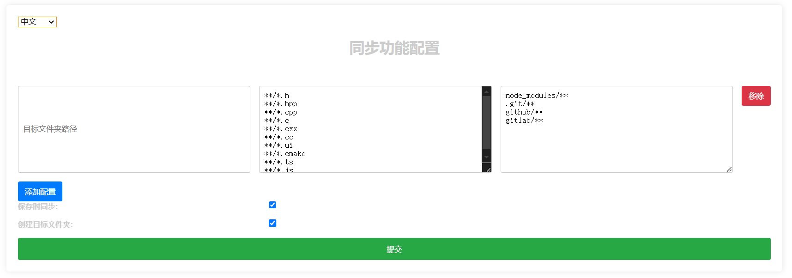

# 介绍

syncOnSave扩展支持在保存的时候把文件保存备份到其他的文件夹，而且支持备份到多个目标文件夹；文件支持正则表达式；支持过滤不需要备份的文件格式配置。

## 特性

- 保存文件时自动备份文件到多个目标文件夹。
- 支持多个路径的备份配置。
- 文件格式支持正则表达式。
- 支持格式过滤和正在表达式。
- 支持同步时文件编码行格式的修改。

## 安装

1. VS Code的插件市场搜索`syncOnSave`安装。
2. 从VS Code Marketplace搜索syncOnSave安装。

## 使用
1. 选择 `syncOnSave.initConfigSyncFile` 命令将打开配置页面并同时初始化创建sync.json文件。
2. 通过WEB页面UI配置同步规则。
3. 如果你熟悉了syncOnSave可以直接手动编辑sync.json文件。

## 配置



通过syncOnSave.initConfigSyncFile命令打开syncOnSave的配置页面：(./resources/config_cn.png)
1. 目标文件夹表示保存文件时想把文件备份到哪个文件夹
2. 包含规则表示哪些文件格式需要被备份，规则支持正则表达式
3. 过滤规则表示哪些文件格式不需要被备份，规则支持正则表达式

```json
{
  "targetFolders": [
    {
      "path": ".",
      "include": ["**/*.ts", "**/*.js"],
      "exclude": ["node_modules/**"]
    }
  ],
  "syncOnSave": true,
  "createTargetFolder": true
}